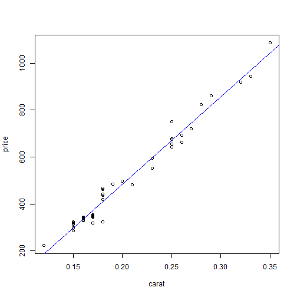

## Slide 2
Simple Regression Model:
 Defines relationship between a dependent variable, and
 a single independent predictor variable.
 The equation for this relationship:
###      y = a + bx
      
#### y: dependent variable
#### x: independent predictor variable
#### a: intercept
#### b: change in y given an increase in x

--- .class #id
## Slide 3
## Diamond Dataset:

#### 48 observations of 2 variables: price and weight

### Using the following linear regression equation:
### fit <- lm(price ~ carat, data=diamond)
### the relevant coefficients are:

```
## Warning: package 'UsingR' was built under R version 3.2.5
```

```
## Loading required package: MASS
```

```
## Loading required package: HistData
```

```
## Warning: package 'HistData' was built under R version 3.2.5
```

```
## Loading required package: Hmisc
```

```
## Warning: package 'Hmisc' was built under R version 3.2.5
```

```
## Loading required package: lattice
```

```
## Loading required package: survival
```

```
## Warning: package 'survival' was built under R version 3.2.5
```

```
## Loading required package: Formula
```

```
## Loading required package: ggplot2
```

```
## Warning: package 'ggplot2' was built under R version 3.2.5
```

```
## 
## Attaching package: 'Hmisc'
```

```
## The following objects are masked from 'package:base':
## 
##     format.pval, round.POSIXt, trunc.POSIXt, units
```

```
## 
## Attaching package: 'UsingR'
```

```
## The following object is masked from 'package:survival':
## 
##     cancer
```

```
## (Intercept)       carat 
##   -259.6259   3721.0249
```

--- .class #id
## A Plot to show the linear relationship between the price and weight in carats


--- .class#id

### Prediction equation:
#### As an example, if weight=0.2 carats, the predicted price will be:


```r
price = coef(fit)[1] + coef(fit)[2]*0.2

price # In Singapore dollars
```

```
## (Intercept) 
##    484.5791
```
#### The price of 0.2 carat diamond is estimated to be S$ 484.58


